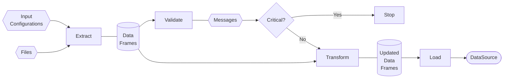

(fundamentals-data-container-ref)=
# Data Container
This document describes the data engine and data sources used in the Dash framework. We start with an overview of the 
underlying data container, the `DataSource` class, and then discuss the ETL process.

## Overview

The `DataSource` class provides a standardized interface for managing tabular data in Python projects, typically using
pandas DataFrames. It supports serialization to and from JSON and Parquet formats, enabling easy saving and loading of 
data sources. Designed to be extensible, the class can be subclassed to accommodate project-specific logic and attributes. 
A `DataSource` instance contains all necessary information to be processed by an `Algorithm` to produce a Scenario, and is 
normally used within ETL workflows.

## Description

The `DataSource` class serves as a base class for various data sources,
providing a standardized interface for handling tabular data, typically stored in pandas DataFrames.
It supports serialization to and from JSON and Parquet formats, making it easy to save and load data sources.
Conceptually, a `DataSource` is expected to contain all the necessary information to be processed by an `Algorithm`, 
to get a `Scenario`.  

### Attributes and Methods
See {ref}`API reference<datasource-ref>` for details.

### DataSourceType Enum
The `ds_type` attribute of a `DataSource` instance indicates its type. 
In practice, the `ds_type` is set during initialization and can be changed using the `set_to_master_data()` method.
Its value is a member of the `DataSourceType` enum, which defines the type of data source:

| Enum Value        | Description                                                                              |
|-------------------|------------------------------------------------------------------------------------------|
| `MASTER_DATA`     | Represents data that is tied to source files, and therefore considered to be immutable   |
| `DERIVED_DATA`    | Represents data that is derived from some master data, and may be changed                |
| `DUMMY_DATA`      | Represents data that is not tied to any source files, and is typically used for testing  |

### Usage
A standard `DataSource` stores data exclusively in its `tables` attribute, which expects to be filled by pandas DataFrames.
The following example demonstrates basic usage:

```python
from src.algomancy import BaseDataSource, DataClassification
import pandas as pd

# Create a DataSource instance
ds = BaseDataSource(DataClassification.MASTER_DATA, name="MyDataSource")

# Add a table
df = pd.DataFrame({'col1': [1, 2], 'col2': ['A', 'B']})
ds.add_table('my_table', df)

# Retrieve a table
retrieved_df = ds.get_table('my_table') 
```

For basic data analysis projects, the standard `DataSource` class may suffice. Note that this is worth considering, as 
it avoids the need to create custom subclasses and implement serialization methods.

```{note}
Creation of a `DataSource` instance directly is uncommon. This is typically handled in-framework by 
an {ref}`ETL process<etl-ref>`.
```

## Custom data source

For a typical project, you will likely need to create a custom subclass of `DataSource` to encapsulate project-specific logic,
attributes, and behaviors. This section outlines the recommended patterns and practices for implementing such subclasses.
To create a custom data source, you should:
1. **Subclass `DataSource`:** Create a new class that inherits from `DataSource`.
2. **Add Custom Attributes:** Define any project-specific attributes and ensure they are serializable.
3. **Implement Serialization Methods:** Override the `to_json` and `from_json` methods to handle any additional attributes or custom logic.

Consider the example of a custom data source that includes a set of locations, each with a name, type (e.g., supplier or customer),
and geographic coordinates (longitude and latitude). The custom data source class would look like this:

```python 
from src.algomancy import BaseDataSource
from typing import Dict
from dataclasses import dataclass
import json


@dataclass
class Location:
    name: str
    type: str  # e.g., 'supplier', 'customer'
    longitude: float
    latitude: float


class MyCustomSource(BaseDataSource):
    def __init__(self, ds_type, name, locations: Dict[str, Location]):
        super().__init__(ds_type, name)
        self._locations = locations
        # Additional initialization as needed

    def to_dict(self):
        """ Convert custom attributes to a dictionary for serialization """
        return {
            'ds_type': self._ds_type,
            'name': self.name,
            'locations': self._locations,
            # Add other custom attributes here
        }

    def to_json(self) -> str:
        """ Custom serialization to JSON including custom attributes """
        return json.dumps(self.to_dict(), indent=2)  # Modify as needed

    @classmethod
    def from_json(cls, json_string: str) -> 'MyCustomSource':
        """ Custom deserialization from JSON including custom attributes """
        instance = cls(**json.loads(json_string))  # Modify as needed
        return instance  # Modify as needed
```

```{note}
The above example is illustrative. You will need to adapt the serialization logic to fit your specific attributes and data structures.
```

(etl-ref)=
# ETL
## Overview

The ETL (Extract, Transform, Load) process is a fundamental component of data engineering and analytics workflows.
It involves extracting data from various sources, transforming it into a suitable format, and loading it into a target 
system for analysis or further processing. In this case, the target format is a `DataSource,` or a class derived thereof. 

## Components of ETL

1. **Extract**: The extraction phase involves retrieving data from different sources, which can include databases, APIs, flat files, or other data repositories. The goal is to gather all relevant data needed for analysis.
2. (**Validation**): After extraction, the data should optionally be validated to ensure it meets the required quality standards. 
   This may involve checking for missing values, data types, and consistency across different datasets.
3. **Transform**: In the transformation phase, the extracted data is cleaned, enriched, and converted into a format that is suitable for analysis. This may involve normalization, aggregation, and applying business rules, among others.
4. **Load**: The loading phase involves writing the transformed data into a target system, such as a data warehouse, data lake, or analytics platform. The data should be organized in a way that supports efficient querying and analysis.

A schematic representation of the ETL process is as follows:



(fundamentals-etl-factory-ref)=
## Abstract Factory pattern

The ETL process is, in this case, implemented the Abstract Factory design pattern. This allows for flexibility and 
extensibility in the ETL process, as different implementations can be created for different data sources. 
Practically, this means that the user is asked to provide a `MyETLFactory` implementation, which implements the 
`create_extractors()`, `create_validation_sequence()`, `create_transformers()`, and `create_loaders()` methods. A detailed 
example will follow below; for now, it suffices to know that the `ETLFactory` is responsible for creating the different 
components of the ETL process.

The following code fragment is an example of a `MyETLFactory` implementation. 
The continued example, below, will show the implementation of the `create_...()` methods; for now, they are left as stubs.

```python 

from src import algomancy as de
from typing import Dict, List


# Create an ETLFactory
class MyETLFactory(de.ETLFactory):
    def __init__(self, configs: List[de.InputFileConfiguration], logger=None):
        super().__init__(configs, logger)

    def create_extractors(self, files: Dict[str, de.File]) -> Dict[str, de.Extractor]:
        ...

    def create_validation_sequence(self) -> de.ValidationSequence:
        ...

    def create_transformers(self) -> list[de.Transformer]:
        ...

    def create_loader(self) -> de.Loader:
        ...
```

Note that the `MyETLFactory` class inherits from `ETLFactory`. This allows the `MyETLFactory` to use its own 
implementation for the `create_...()` methods to run the standardized `build_pipeline()` method, which in turn will 
run the ETL process. Aside from the `create_...()` methods, the `MyETLFactory` class typically only needs to implement an `__init__()` method,
which takes a list of `InputFileConfiguration` instances, and an optional logger. 

The `InputFileConfiguration` instances are used to configure the extractors, as described below. They follow a fairly rigid
structure, which is to be configured by the user.

We will now discuss the following five components of the ETL process in more detail:
1. `InputFileConfiguration`
2. `Extractor`
3. `ValidationSequence`
4. `Transformer`
5. `Loader`

## InputFileConfiguration

The `InputFileConfiguration` class is used to configure the extractors. It is a simple data structure that contains the following attributes:
- `extension`: The file type of the associated raw data. For example, CSV, JSON, or XLSX.
- `file-name`: The name of the associated raw data.
- `file_schema`: The expected data type configuration of the file.

Consider the following code fragment:

```python

from src import algomancy as de
from typing import Dict, List


class WarehouseLayoutSchema(de.Schema):
    """Schema class that holds column names for warehouse layout data"""

    ID = "slotid"  # -- optionally declare column names here
    X = "x"
    Y = "y"
    ZONE = "zone"

    @property
    def datatypes(self) -> Dict[str, de.DataType]:  # -- necessary property that is used by the extractor
        return {
            WarehouseLayoutSchema.ID: de.DataType.STRING,
            WarehouseLayoutSchema.ZONE: de.DataType.STRING,
            WarehouseLayoutSchema.X: de.DataType.FLOAT,
            WarehouseLayoutSchema.Y: de.DataType.FLOAT,
        }


warehouse_config = de.InputFileConfiguration(  # -- create an InputFileConfiguration instance
    extension=de.FileExtension.CSV,
    file_name="warehouse_layout",
    file_schema=WarehouseLayoutSchema(),
)

# -- create your own InputFileConfigurations here

input_configs = [warehouse_config, ...]  # -- list of InputFileConfiguration instances 
```

The code fragment contains three main sections The first section is used to declare the column names of the 
`WarehouseLayoutSchema` class. This is optional, but it is recommended to do so, as it allows for more readable code, 
and allows your IDE to provide autocompletion. 

The second section declares the datatypes of the columns as `de.DataType`s. The supplied types are used by the extractor to
set the correct data types for the columns. This also serves as a validation step, as the extractor will raise a warning if the
column types cannot be set as expected. 

The Enum class `DataType` is a simple wrapper to provide the right string values to pandas; its members should not require
any further explanation. The available `DataType`s are:
- `STRING`
- `DATETIME`
- `INTEGER`
- `FLOAT`
- `BOOLEAN`
- `CATEGORICAL` (not implemented yet)
- `INTERVAL` (not implemented yet)

The third section creates the `InputFileConfiguration` instances and compiles the supplied instance in a list,
which is used to configure the extractors. 
Each `InputFileConfiguration` instance is used to configure a single extractor. The `file_name` attribute is used to
match the extractor to the corresponding file, which is discussed in the next section.


## Extractor

The ETL pipeline expects a single `Extractor` for each `File`. In practice, the user will use either a `SingleExtractor`
or a `MultiExtractor`; the latter is used when the file contains multiple data sets, though both are structurally similar.

The `SingleExtractor` has the following exposed attributes:

| Attribute / Method | Type / Signature       | Description                                                                 |
|--------------------|------------------------|-----------------------------------------------------------------------------|
| `file`             | `de.File`              | The associated file.                                                        |
| `schema`           | `de.Schema`            | The expected data type configuration of the output DataFrame.               |
| `logger`           | `de.Logger`            | An optional logger to document any errors that occur during extraction.     |
| `extract()`        | `Dict[str, DataFrame]` | Extracts the data from the file. The associated name is stored in the `key` |

The `MultiExtractor` has the following exposed attributes:

| Attribute / Method | Type / Signature       | Description                                                             |
|--------------------|------------------------|-------------------------------------------------------------------------|
| `file`             | `de.File`              | The associated file.                                                    |
| `schemas`          | `Dict[str, de.Schema]` | A Schema configuration for each output DataFrame                        |
| `logger`           | `de.Logger`            | An optional logger to document any errors that occur during extraction. |
| `extract()`        | `Dict[str, DataFrame]` | Extracts the data from the file.                                        |


### Using extractors
Before we discuss the implementation of extractors, we will first discuss how to use them.

In practice, the user will primarily 'tell the ETLFactory' which extractor to use for which file, and which datatypes to 
expect in the output DataFrame. This is done by implementing the `create_extractors()` method of the `ETLFactory` class.
Consider the following example implementation.

```python

from src import algomancy as de
from typing import Dict, List


# Create an ETLFactory
class MyETLFactory(de.ETLFactory):
    ...

    def create_extractors(self, files: Dict[str, de.File]) -> Dict[str, de.Extractor]:
        """ """

        # declare expected names
        sku_data = "sku_data"
        employee = "employees"

        # construct a dictionary of expected schemas
        schemas = {cfg.file_name: cfg.file_schema for cfg in self.input_configurations}

        # Optionally check that the expected files were passed and the schemas match the file names

        extractors = {
            sku_data: de.CSVExtractor(
                file=files[sku_data],  # -- constains a CSVFile
                schema=schemas[sku_data],
                logger=self.logger,
                separator=";",
            ),
            employee: de.JSONExtractor(
                file=files[employee],  # -- contains a JSONFile
                schema=schemas[employee],
                logger=self.logger,
            ),
        }

        return extractors

```
The example above uses the pre-build CSVExtractor and JSONExtractor to extract the data from the files.
It should be clear from the example above that the implementation of `create_extractors()` is fairly straightforward.
The user simply needs to create an instance of the desired extractor, and pass it the correct arguments.

Most of the 'work,' related to this part of the project, is the implementation of any custom extractors. Most of the time,
this will likely not be required. However, some deeply nested JSON data structures may require custom extractors, and any 
file types that are not supported by the pre-built extractors will also require a custom extractor.

### Pre-built extractors 
For common file types, such as CSV, JSON, and XLSX, pre-built extractors are provided. These are `SingleExtractors` that can be used
directly, without the need to create a custom extractor. The pre-built extractors are:
- `CSVExtractor` (optionally set the `delimiter` attribute, which defaults to a semicolon `;`)
- `JSONExtractor`
- `XLSXExtractor` (optionally set the `sheet_name` attribute, which defaults to the first sheet)

### Creating custom extractors
To create a custom extractor, the user needs to create a class that inherits from either `SingleExtractor` or `MultiExtractor`. 
The class should primarily implement the `_extract_file()` method, is used to extract the data from the file. Consider 
the example, below.

```python
import pandas as pd
import json
from io import StringIO

import algomancy_data as de
from algomancy.dashboardlogger import Logger
from typing import Dict, List


class JSONExtractor(de.SingleExtractor):
    """ Handles extraction of data from JSON files. """
    def __init__(self, file: de.JSONFile, schema: de.Schema, logger: Logger = None) -> None:
        super().__init__(file, schema, logger)

    def _extract_file(self) -> pd.DataFrame:
        # extract the raw json data
        json_data = json.load(StringIO(self.file.content))
        
        # convert the json data to a pandas DataFrame
        df = pd.json_normalize(json_data['data'])  # -- implement your own logic here 

        return df

```

## Validators

The `Validators` aim to check the integrity of the raw data. Each `Validator` should be responsible for checking a single 
aspect of the data. The `Validator` class has a single exposed method, `validate()`, which takes a dictionary of
`DataFrame`s as input. The `validate()` method should return a list of `ValidationMessage`s, which are used to document 
any errors that occur during validation.

`ValidationSequence`, in turn, is simply a wrapper that executes a list of `Validator`s and compiles the results. 
Afterwards,the `ValidationSequence` can be used to check whether any of the `ValidationMessage`s are of `CRITICAL` 
severity, in which case the ETL process is stopped. 

### Anatomy of the related classes. 
We treat the related classes from top to bottom.

The `ValidationSequence` has the following exposed attributes and methods:

| Attribute / Method   | Type / Signature                                                      | Description                                                                                                          |
|----------------------|-----------------------------------------------------------------------|----------------------------------------------------------------------------------------------------------------------|
| `completed`          | `bool`                                                                | `True` if the validation has been run, `False` otherwise                                                             |
| `messages`           | `List[de.ValidationMesssage]`                                         | List of messages that has been created by the `Validator`s in the sequence                                           |
| `is_valid`           | `bool`                                                                | `True` if the sequence has been run and no messages have severity `CRITICAL`, `False` otherwise                      |
| `add_validator()`    | `validator: de.Validator -> None`                                     | Adds a `Validator` to the sequence.                                                                                  |
| `add_validators()`   | `validators: List[de.Validator] -> None`                              | Adds a list of `Validator`s to the sequence                                                                          | 
| `run_validation()`   | `data: Dict[str, pd.DataFrame] -> (bool, List[de.ValidationMessage])` | Validates the data. Returns a list of `ValidationMessage`s and a `bool` that is `True` if no messages are `CRITICAL` |


The `Validator` has the following exposed attributes and methods:

| Attribute / Method | Type / Signature                                              | Description                                                                                                                                                 |
|--------------------|---------------------------------------------------------------|-------------------------------------------------------------------------------------------------------------------------------------------------------------|
| `messages`         | `List[de.ValidationMessage]`                                  | List of messages that have been created by the `Validator`. Flushes buffer before returning the list.                                                       |
| `add_message()`    | `message: de.ValidationMessage -> None`                       | Adds a `ValidationMessage` to the list of messages.                                                                                                         |
| `buffer_message()` | `message: de.ValidationMessage -> None`                       | Adds a `ValidationMessage` to an internal buffered list of messages.                                                                                        |
| `flush_buffer()`   | `sucess_message: de.ValidationMessage -> None`                | Adds all of the messages in the buffered list to the persistent list. If the buffered list was empty, add `success_message` to the persistent list instead. |
| `validate()`       | `data: Dict[str, pd.DataFrame] -> List[de.ValidationMessage]` | Validates the data. Returns a list of `ValidationMessage`s.  *Must be implemented by the user*                                                              |


The `ValidationMessage` has the following exposed attributes and methods:

| Attribute / Method | Type / Signature           | Description                                                                    |
|--------------------|----------------------------|--------------------------------------------------------------------------------|
| `severity`         | `de.ValidationSeverity`    | The severity of the message. Can be `INFO`, `WARNING`, `ERROR`, or `CRITICAL`  |
| `message`          | `str`                      | The message text.                                                              |

### Using validators
The user will typically need to implement their own validators, as most data validation requires a decent bit of context. 
When the `Validators` have been created, the implementation of `create_validation_sequence()` is, once again, fairly straightforward. 
The user simply needs to create an instance of the desired `ValidationSequence`, and add the desired `Validator`s to by 
calling the `add_validator()` method. Consider the following example implementation.

```python

from src import algomancy as de
from typing import Dict, List


# Create an ETLFactory
class MyETLFactory(de.ETLFactory):
    ...

    def create_validation_sequence(self) -> de.ValidationSequence:
        vs = de.ValidationSequence(logger=self.logger)

        vs.add_validator(de.ExtractionSuccessVerification())

        return vs

```


### Creating a validator
To create a custom validator, the user needs to create a class that inherits from `Validator`. The class should primarily
implement the `validate()` method, which is used to validate the data. Consider the following example implementation.

```python
import pandas as pd

import algomancy_data as de
from typing import Dict, List

class ExtractionSuccessVerification(de.Validator):
    """ Checks that the extraction of each single dataframe was successful. """
    def __init__(self) -> None:
        super().__init__()
    
    def validate(self, data: Dict[str, pd.DataFrame]) -> List[de.ValidationMessage]:
        """ The necessary validation logic. """
        
        # check that each dataframe is not empty
        for name, df in data.items():
            if df.empty:
                self.buffer_message(de.ValidationSeverity.CRITICAL, f"Extraction of {name} returned empty DataFrame.")
                
        # flush the buffer and return the messages
        self.flush_buffer(success_message="All dataframes were extracted successfully.")
        return self.messages
```
The above example is a basic validator, which simply checks that each dataframe is not empty; the actual implementation 
depends mostly on the extracted data, in context. Two points to note:
- The `validate()` method should return a list of `ValidationMessage`s, which are used to document any errors that occur during validation. `CRITICAL` messages will stop the ETL process; other messages mostly serve as informational messages, and are styled differently in the logging section of the dashboard. 
- The user can either use the `add_message()` or `buffer_message()` methods to add messages to the list of messages. The `flush_buffer()` method is used to add all of the messages in the buffered list to the persistent list. If the buffered list was empty, add `success_message` to the persistent list instead. This is a practical way to ensure that the `ValidationSequence` always returns a list of messages upon completion, for progress tracking. 


## Transformers
> _DeprecatedWarning: At some point, this will be moved to a TransformerSequence._ 

Transformers are a critical component of the ETL process, responsible for cleaning, normalizing, and reshaping raw data into a consistent and usable structure. Each `Transformer` operates on a dictionary of input `DataFrame`s, performing its transformation in-place or creating new tables as needed.

The base `Transformer` class requires only the implementation of a single method:

| Attribute / Method      | Type / Signature                             | Description                                                                        |
|-------------------------|----------------------------------------------|------------------------------------------------------------------------------------|
| `transform()`           | `data: Dict[str, pd.DataFrame] -> dict[...]` | Transforms the data in the provided dictionary. Must be implemented by subclasses. |
| `name`                  | `str`                                        | Human-readable name for the transformer.                                           |

Most transformers *mutate* the input dictionary in-place. By convention, they should document what tables are expected before and after the operation.

### Common Transformers

Several ready-to-use, prebuilt transformers are provided:
- **NoopTransformer**: Passes data through unchanged. Useful for debugging or pipeline scaffolding.
- **CleanTransformer**: Drops rows with missing values and lowercases/strips all column names.
- **JoinTransformer**: Merges/join two tables on a given column and adds the result under a new table name.

Example usage of creating a transformer in the factory:

```python

from src import algomancy as de
from typing import Dict, List


# Create an ETLFactory
class MyETLFactory(de.ETLFactory):
    ...

    def create_transformers(self) -> list[de.Transformer]:
        """ Create and return a list of transformers to be applied in sequence. """
        transformers = []

        transformers.append(de.CleanTransformer(logger=self.logger))

        return transformers
```

### Creating a transformer
To create a custom transformer, the user needs to create a class that inherits from `Transformer`. The class should primarily
implement the `transform()` method, which is used to transform the data. Consider the following example implementation.

```python
import pandas as pd
from src import algomancy as de


class CleanTransformer(de.Transformer):
    def __init__(self, logger=None) -> None:
        super().__init__(name="CleanTransformer", logger=logger)

    def transform(self, data: dict[str, pd.DataFrame]) -> None:
        """ the necessary transformation logic."""
        if self.logger:
            self.logger.log("Cleaning dataframes (dropna, lowercase columns)")
        for name, df in data.items():
            df = df.dropna()
            df.columns = [c.lower().strip() for c in df.columns]
```

## Loader

The Loader is responsible for the final step of the ETL process: persisting or handing off the transformed data to its destination format, which is a `DataSource` or a class derived from `DataSource`.
This means combining the (possibly multiple) DataFrames to create some number of persistent object, to be stored in the `DataSource` model.

The `Loader` base class defines the required method:

| Attribute / Method     | Type / Signature                                                                                   | Description                                                              |
|------------------------|----------------------------------------------------------------------------------------------------|--------------------------------------------------------------------------|
| `load()`               | `(name: str, data: Dict[str, pd.DataFrame], messages: List[ValidationMessage], ...) -> DataSource` | Combines the transformed data and completes loading into a `DataSource`. |

The `Loader` is called at the very end of the ETL pipeline, after validation and transformation are complete.

### Example Loader Usage

The framework provides a basic data loader as `DataSourceLoader`, which simply combines all DataFrames into a standard `DataSource` instance.
A custom loader is necessary when the implementation intends to use a Custom Data Source. 

Again, the implementation of `create_loader()` is straightforward; the main task is to create an instance of the desired `Loader`.
Consider the following example implementation.

```python

from src import algomancy as de
from typing import Dict, List


class MyETLFactory(de.ETLFactory):
    ...

    def create_loader(self) -> de.Loader:
        return MyCustomSourceLoader(self.logger)


```
The above simply creates an instance of the `MyCustomSourceLoader` class, which is a subclass of `Loader`, and could be 
implemented as follows.

### Creating a Loader

```python

from src import algomancy as de
import pandas as pd
from algomancy.dashboardlogger import Logger
from typing import Dict, List


# suppose that the MyCustomSource example, from the DataSource section, is imported here

# suppose, moreover, that the ETL pipeline up to this point has yielded a pair of DataFrames, customers and suppliers, 
#    which both describe locations in the obvious way.

class MyCustomSourceLoader(de.Loader):
    def __init__(self, logger: Logger) -> None:
        super().__init__(logger=logger)

    def load(
            self, name: str, data: Dict[str, pd.DataFrame], messages: List[de.ValidationMessage],
            ds_type: de.DataClassification
    ) -> MyCustomSource:
        """ Combines the transformed data into a DataSource. """
        customers = data['customers']
        suppliers = data['suppliers']

        locations = {}
        for customer in customers.iterrows():
            locations[customer['name']] = Location(name=customer['name'], type="customer",
                                                   longitude=customer['longitude'],
                                                   latitude=customer['latitude'])

        for supplier in suppliers.iterrows():
            locations[supplier['id']] = Location(name=supplier['id'], type="supplier", longitude=supplier['lat'],
                                                 latitude=supplier['lon'])

        return MyCustomSource(ds_type=de.DataClassification.MASTER_DATA, name="example", locations=locations)


```